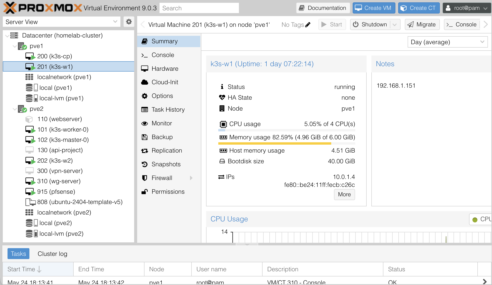
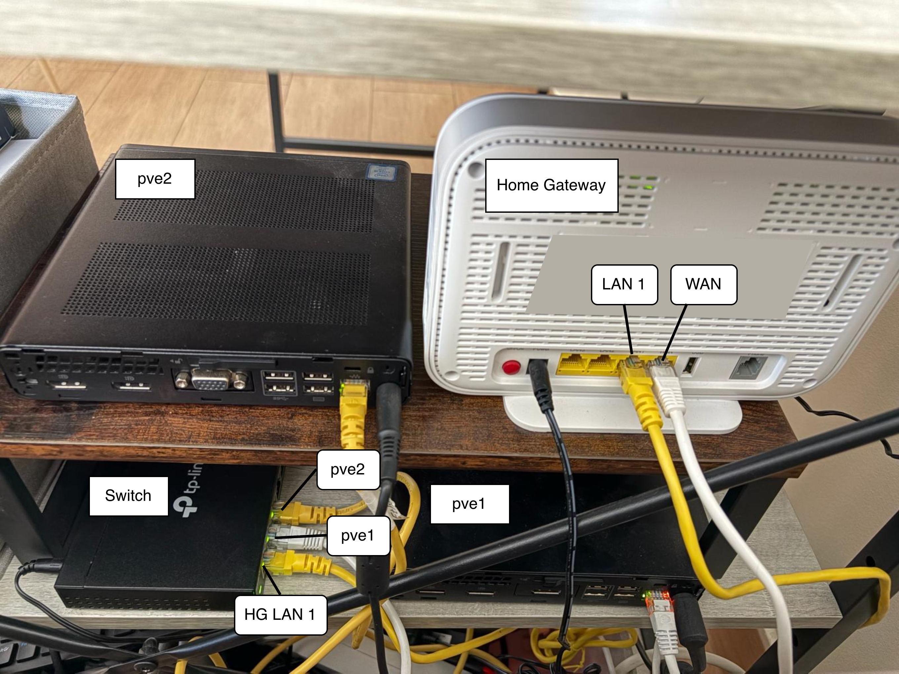
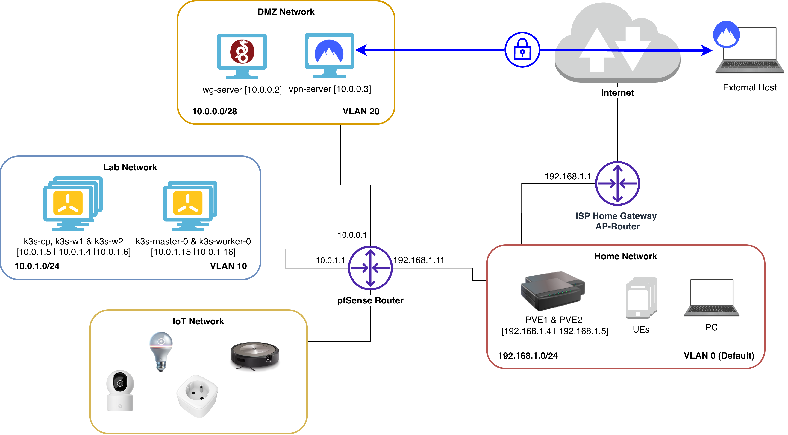

# Homelab Documentation

In this repository, I document the homelab I have been building over the last year. The goal of this repo is to share my homelabbing journey: the choices, the constraints, the trade-offs, and the things I have learned (and broken) along the way.

As an experienced DevOps and platform engineer, I wanted a place to run my personal projects and PoCs. In the end, things that look and behave like production: real networks, real segmentation, real virtualization, real Kubernetes. The lab has grown from a single mini PC into the setup I will describe below.

## Quick Links

- 🔧 [Hardware](./docs/hardware.md)
- 🌐 [Networking](./docs/networking.md)
- 💻 [VM Inventory](./docs/vm-inventory.md)
- 📘 [Tutorials](./tutorials/)

## Repo Structure

```
homelab-documentation/
├── docs/
│   ├── hardware.md           # Hardware specs, diagrams, and budget
│   ├── networking.md         # Network topology, VLANs, and device configurations
│   ├── vm-inventory.md       # Proxmox VM and LXC inventory
│   ├── wg-vpn-to-homelab.md  # WireGuard VPN setup guide
│   ├── nordvpn-to-homelab.md # NordVPN Meshnet access guide
│   ├── faq.md                # Frequently asked questions
│   ├── pending_tasks.md      # Ongoing and planned work
│   └── assets/
│       └── images/           # Diagrams and screenshots
├── tutorials/
│   ├── k3s.md                # K3s cluster setup
│   └── vms.md                # VM provisioning
└── README.md
```

## What I Wanted to Build



Before buying any hardware I tried to be honest about what I actually wanted out of this lab:

- A flexible platform to expand my knowledge of **virtualization**, like Proxmox VE.
- A real **Kubernetes** environment to deploy services to (not a single-node `kind` or `minikube` cluster).
- A **segmented network** so I could play with VLANs, firewalls, and routing instead of putting everything on the same flat LAN.
- **Secure remote access** to the lab from anywhere — without exposing services to the open internet.
- Something that could fit on a shelf, run 24/7, and not show up too visibly on my electricity bill.

I tried to follow the KISS principle: each new piece had to earn its place, and I would rather have two clean nodes than five messy ones.

## The Hardware



The compute side of the lab is built around **two HP EliteDesk 800 G3 Desktop Mini** units, bought refurbished and matched in resources (4-core Intel i5 CPUs, 16 GB of RAM, and 256 GB SSD/NVMe storage each). They are small, quiet, and energy-efficient — exactly what I wanted for a 24/7 setup at home.

On the networking side I went with a **TP-Link TL-SG608E** — a small, 8-port managed switch with full 802.1Q VLAN support. It is cheap, silent, and does everything I need at this scale.

At this moment, the internet uplink and the home Wi-Fi are still handled by the ISP-provided Home Gateway AP-Router, a **DIGI ZTE H3600P**. It sits in front of everything and only sees one IP from the lab (pfSense's WAN address).

### Budget

| Device                     | Cost                       |
|----------------------------|----------------------------|
| HP EliteDesk 800 G3 DM 35W | ~129€ (Refurbished) [2025] |
| HP EliteDesk 800 G3 DM 65W | ~160€ (Refurbished) [2025] |
| tp-link TL-SG608E          | 32,99€ [2026]              |
| DIGI ZTE H3600P            | Included with my ISP plan  |

## The Network Topology



**pfSense** is the brain of the lab. It runs as a VM on `pve2` with three virtual NICs — one per VLAN — and handles routing, DHCP, and firewalling between segments.

The lab is split into the following networks:

- **VLAN 0 (Default) — Home Network — `192.168.1.0/24`**
  This is my home LAN and also the homelab's management network. It is where I reach Proxmox, pfSense, and the switch admin UIs. It is also the only VLAN the ISP router can see directly. Splitting guest Wi-Fi off this network is on my to-do list.

- **VLAN 10 — Lab Network — `10.0.1.0/24`**
  The "real" homelab network. All Proxmox VMs and LXCs land here by default. This is also where both of my K3s clusters live.

- **VLAN 20 — DMZ — `10.0.0.0/28`**
  A small isolated segment for the VPN bastion servers. Only these two hosts live here, and pfSense rules tightly control what they can reach.

- **VLAN 30 — IoT — WIP**
  Reserved for future smart-home devices.

On the switch, ports 2 and 3 (connected to `pve1` and `pve2`) are configured as **trunk ports** carrying VLAN 10 and VLAN 20 tagged, with VLAN 1 untagged for management. Inside each Proxmox node, all VLANs flow through a single Linux bridge (`vmbr0`); the VLAN tag is applied at the VM NIC level.

## The Workloads

Running on top of this network are two Kubernetes clusters and a pair of VPN bastions:

- A **K3s "Central" cluster** spread across both Proxmox nodes (1 master + 2 workers). This is my main playground for deploying services.
- A **K3s "Remote" cluster** (1 master + 1 worker) used to experiment with multi-cluster scenarios.
- A **WireGuard server** and a **NordVPN Meshnet bastion**, both living in the DMZ, that let me reach lab services from anywhere.
