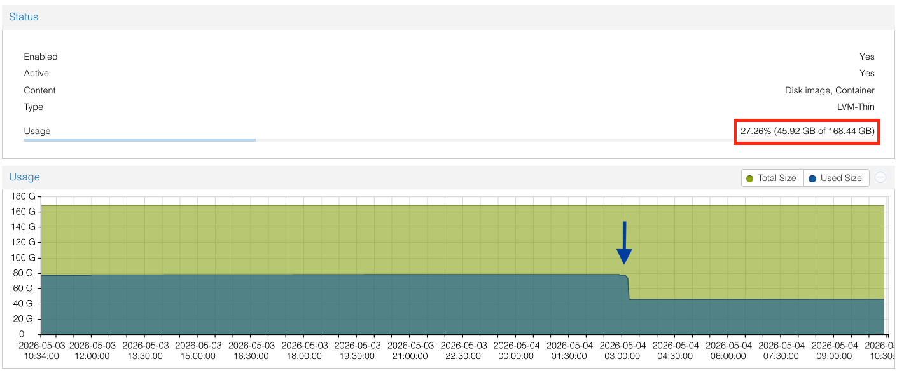
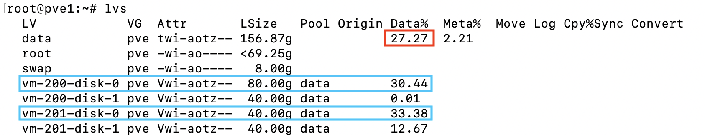
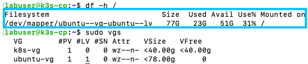
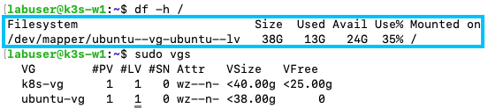

# FAQs
- *¿Coincide el uso de almacenamiento de un nodo (local-lvm) con el uso de cada una de las VMs que lo componen?*  
Evidentemente sí. No obstante, a menudo el reporte de uso no cuadran debido a que aún no se ha ejecutado el TRIM del LVM.





Vemos que en el caso de las imágenes, al haberse realizado recientemente el trim (columna *Data%* en la salida de `lvs`), el reporte de porcentaje de usos coincide. El VG *k8s-vg* está gestionado por TopoLVM y para ver el uso real de sus LVs, habría que montar cada uno de sus discos correspondientes (`/dev/k8s-vg/*`) en modo lectura o consultarlo directamente en sus Pods (donde ya seguramente estén montados). No obstante, lo más recomendable es verificar su uso en la monitorización.

---

- *¿Qué es el TRIM y cómo afecta al reporte de uso de disco en LVM?*

El TRIM (o discard) es una operación que informa al almacenamiento del host, qué bloques ya no están en uso y pueden ser reclamados. En LVM-thin, cuando eliminamos archivos dentro de una VM, el espacio no se libera automáticamente en el thin pool del host hasta que se ejecuta el TRIM.

**¿Por qué hay veces que no cuadran los reportes?**
- La VM reporta el espacio libre correctamente (ve los bloques eliminados)
- El host sigue viendo esos bloques como "en uso" hasta que recibe el TRIM

**Cómo ejecutar TRIM manualmente:**
```bash
# Dentro de la VM (libera bloques hacia el host)
fstrim -av

# En el host, verificar el uso real del thin pool
lvs
```

El servicio `fstrim.timer` ejecuta TRIM semanalmente. Verifica que esté activo:
```bash
systemctl status fstrim.timer
systemctl list-timers 
```