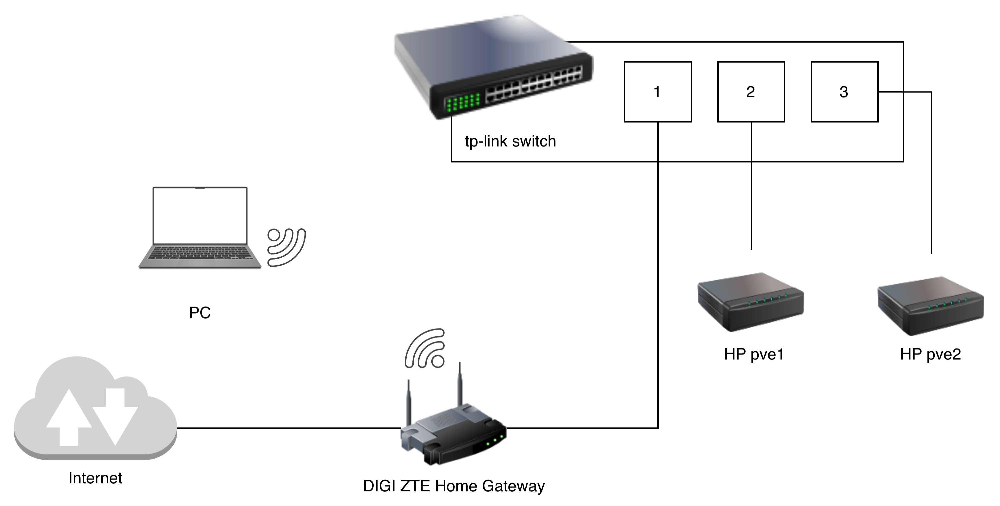

# Hardware
Compute, networking, and connectivity gear that the homelab runs on, plus the total budget.

## Hardware Architecture Diagram

## Specs
| PVE Node | Model                      | CPU                     | Memory | System Disk     |
|----------|----------------------------|-------------------------|--------|-----------------|
| pve1     | HP EliteDesk 800 G3 DM 35W | 4 x Intel Core i5-6400T | 16 GB  | 256 GB SSD/NVMe |
| pve2     | HP EliteDesk 800 G3 DM 65W | 4 x Intel Core i5-7500T | 16 GB  | 256 GB SSD/NVMe |

| Switch Model      | Ports                   |
|-------------------|-------------------------|
| tp-link TL-SG608E | 8 RJ45 10/100/1000 Mbps |

| ISP Home Gateway Model | Ethernet Connectivity                    | Wi-Fi Connectivity                                    |
|------------------------|------------------------------------------|-------------------------------------------------------|
| DIGI ZTE H3600P        | 1 Gigabit WAN port + 3 Gigabit LAN ports | Wi-Fi 6 AX1800 1201 Mbps (5 GHz) + 574 Mbps (2,4 GHz) |

### Budget

| Device                     | Cost                       |
|----------------------------|----------------------------|
| HP EliteDesk 800 G3 DM 35W | ~130€ (Refurbished) [2025] |
| HP EliteDesk 800 G3 DM 65W | ~140€ (Refurbished) [2025] |
| tp-link TL-SG608E          | 32,99€ [2026]              |
| DIGI ZTE H3600P            | Included with my ISP plan  |