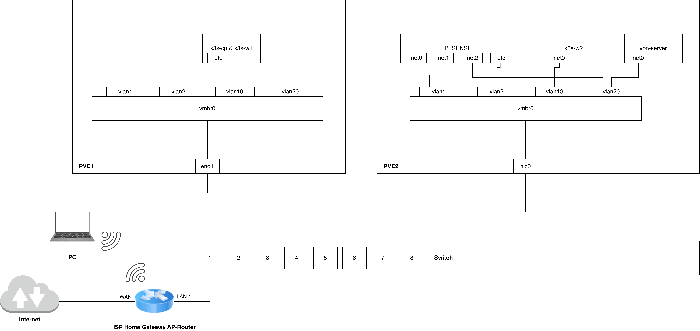
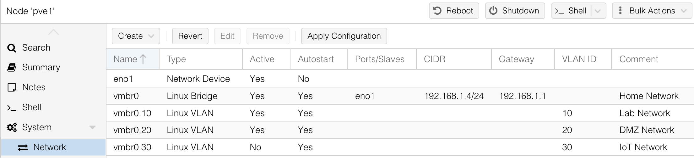
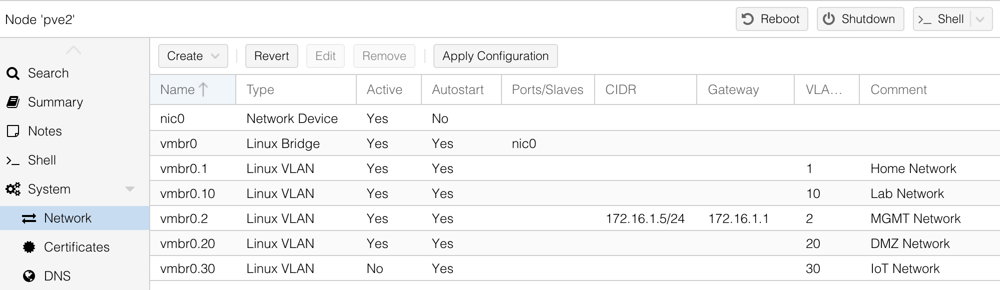

# Networking
Overview of the homelab network topology, VLANs, and device configurations.

<figure>
  
  <figcaption>L3 Architecture Diagram</figcaption>
</figure>

## Network List

### VLAN 0 (Default): Home Network
*192.168.1.0/24*  

**Relevant IPs**
- 192.168.1.1: ISP Home Gateway AP-Router
  - Internet Default Gateway
  - DHCP Server

- 192.168.1.2: tp-link Switch MGMT IP
- 192.168.1.11: pfSense MGMT IP
- 192.168.1.4: PVE1 MGMT IP
- 192.168.1.5: PVE2 MGMT IP

**Notes**
- It is the Home LAN network and the Homelab MGMT network. 
- Also accessible via Wi-Fi through *ISP Home Gateway AP-Router*. 

> [!WARNING]
> Major updates are planned to split the guests' Wi-Fi access from the MGMT network (for security reasons).

### VLAN 10: Lab Network
*10.0.1.0/24* 

**Relevant IPs**
- 10.0.1.1: pfSense
  - Internet Default Gateway
  - DHCP Server

- 10.0.1.5 | 10.0.1.4 | 10.0.1.6: K3s Central Cluster Nodes (Master | Worker 1 | Worker 2)
- 10.0.1.15 | 10.0.1.16: K3s Remote Cluster Nodes (Master | Worker 1)

**Notes**
- It is the main Homelab network where all Proxmox VMs and LXCs are deployed by default.

### VLAN 20: DMZ Network
*10.0.0.0/28*  

**Relevant IPs**
- 10.0.0.1: pfSense
  - Internet Default Gateway
  - DHCP Server

- 10.0.0.2: WG Server
  - Wireguard Bastion Host

- 10.0.0.3: NordVPN Server
  - NordVPN Meshnet Bastion Host

**Notes**
- Demilitarized Zone network hosting the VPN bastion servers, which provide secure access to services in the Lab network.

### VLAN 30: IoT Network 
> [!NOTE]
> Work in progress

## Configuration
<figure>
  
  <figcaption>L2 Architecture Diagram with some relevant VMs. See the full [VM inventory](./vm-inventory.md).</figcaption>
</figure>

### Switch - 802.1Q VLAN Configuration
| VLAN ID | VLAN Name | Untagged Ports | Tagged Ports |
|---------|-----------|----------------|--------------|
| 1       | Default   | 1-3            |              |
| 10      | Lab       |                | 2-3          |
| 20      | DMZ       |                | 2-3          |
| 30      | IoT       | WIP                           |

### PVE 1 - Network Configuration

### PVE 2 - Network Configuration

### ISP Home Gateway AP-Router Configuration
**Interfaces**
| Name      | Static IPv4 Address |
|-----------|---------------------|
| WAN       | -                   | 
| LAN/WLAN  | 192.168.1.1/24      |

**DHCP Server Address Pool**
| Interface | Subnet         | Address Pool Range         |
|-----------|----------------|----------------------------|
| LAN       | 192.168.1.0/24 | 192.168.1.11-192.168.1.254 |

**DHCP Server Static Mappings**
| IP Address    | Name           |
|---------------|----------------|
| 192.168.1.11  | pfsense-router |

### pfSense Configuration
**Interfaces**
| Name | Config Type | Static IPv4 Address |
|------|-------------|---------------------|
| WAN  | DHCP        | -                   |
| LAB  | Static IPv4 | 10.0.1.1/24         |
| DMZ  | Static IPv4 | 10.0.0.1/28         |
| IoT  | WIP                               |

**DHCP Server Address Pool**
| Interface | Subnet      | Address Pool Range   |
|-----------|-------------|----------------------|
| LAB       | 10.0.1.0/24 | 10.0.1.20-10.0.1.254 |
| DMZ       | 10.0.0.0/28 | 10.0.0.8-10.0.0.14   |

**DHCP Server Static Mappings**
| IP Address | Hostname     | Description                          |
|------------|--------------|--------------------------------------|
| 10.0.0.2   | wg-server    | Wireguard Bastion Host               |
| 10.0.0.3   | vpn-server   | NordVPN Meshnet Bastion Host         |
| 10.0.1.15  | k3s-master-0 | K3s Master Node Remote Cluster       |
| 10.0.1.16  | k3s-worker-0 | K3s Worker Node 1 Remote Cluster     |
| 10.0.1.5   | k3s-cp       | K3s Master Node Central Cluster      |
| 10.0.1.4   | k3s-w1       | K3s Worker Node 1 Central Cluster    |
| 10.0.1.6   | k3s-w2       | K3s Worker Node 2 Central Cluster    |

**Firewall Rules**  
*WIP*

**DNS Server**  
*WIP*

### VMs Network Configuration
See the full [VM inventory](./vm-inventory.md).
