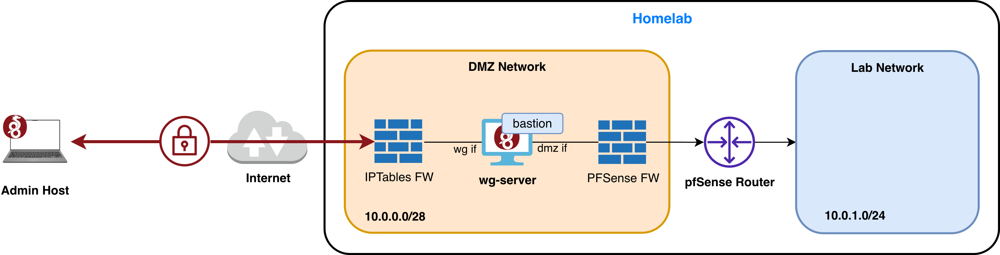

# VPN to Homelab - WireGuard

This is the **user-facing VPN** to the homelab — the path I use to grant *limited, scoped* access to specific Lab services from outside the home network. Unlike the [NordVPN Meshnet admin bastion](./nordvpn-to-homelab.md), this one is designed for collaborators, family and services.

The tunnel only routes traffic to the Lab subnet (`10.0.1.0/24`). Everything else on the homelab stays unreachable.

- VPN: **WireGuard**  
- VM bastion: **wg-server** (DMZ, `10.0.0.2`)  



## Setup overview

The setup spans four places:

1. **The wg-server VM** — install WireGuard, generate keys, write `wg0.conf`, start the tunnel.
2. **The ISP router** — get a public IP, port-forward UDP 51820 to pfSense, configure DDNS.
3. **pfSense** — port-forward UDP 51820 from HOME to wg-server in DMZ.
4. **Each peer** — write a peer `wg0.conf` with the server as endpoint and bring it up.

---

### 1. Configure the wg-server VM

**Install WireGuard** 
```bash
sudo apt update
sudo apt install wireguard
```

**Generate the server key pair**  
```bash
wg genkey | tee server.key | wg pubkey > server.pub
```

**Write `/etc/wireguard/wg0.conf`**   
```ini
[Interface]
Address = 10.10.0.1/24
ListenPort = 51820
PrivateKey = <wg-server_private_key>

# Enable IP forwarding and allow traffic only to WG and LAB subnets
PostUp = sysctl -w net.ipv4.ip_forward=1
PostUp = iptables -A FORWARD -i wg0 -d 10.10.0.0/24 -j ACCEPT
PostUp = iptables -A FORWARD -o wg0 -d 10.10.0.0/24 -j ACCEPT
PostUp = iptables -A FORWARD -i wg0 -d 10.0.1.0/24 -j ACCEPT
PostUp = iptables -A FORWARD -o wg0 -d 10.0.1.0/24 -j ACCEPT
PostUp = iptables -A FORWARD -i wg0 -j DROP
PostUp = iptables -t nat -A POSTROUTING -o eth0 -j MASQUERADE

PostDown = iptables -D FORWARD -i wg0 -d 10.10.0.0/24 -j ACCEPT
PostDown = iptables -D FORWARD -o wg0 -d 10.10.0.0/24 -j ACCEPT
PostDown = iptables -D FORWARD -i wg0 -d 10.0.1.0/24 -j ACCEPT
PostDown = iptables -D FORWARD -o wg0 -d 10.0.1.0/24 -j ACCEPT
PostDown = iptables -D FORWARD -i wg0 -j DROP
PostDown = iptables -t nat -D POSTROUTING -o eth0 -j MASQUERADE

[Peer]
PublicKey = <peer-1_public_key>
AllowedIPs = 10.10.0.2/32

[Peer]
PublicKey = <peer-2_public_key>
AllowedIPs = 10.10.0.3/32

[Peer]
PublicKey = <peer-3_public_key>
AllowedIPs = 10.10.0.4/32
```

> [!NOTE]
> The `iptables` rules form a tight allowlist: peers can only reach each other (`10.10.0.0/24`) and the Lab subnet (`10.0.1.0/24`). Any other destination they try to route to hits the explicit `DROP` rule.

**Start the tunnel**  
```bash
sudo wg-quick up wg0
sudo systemctl enable wg-quick@wg0   # auto-start on boot
```

### 2. Expose the endpoint via the ISP router

**Request a public IP**   
DIGI's default fibre plan uses CGNAT, which won't accept inbound connections. I added their **Conexión Plus** add-on (~1€/month) to get a publicly reachable IP address.

**Port-forward UDP 51820 to pfSense**   
| Name      | Protocol | WAN IP  | LAN Host     | WAN Port | LAN Port |
|-----------|----------|---------|--------------|----------|----------|
| wireguard | UDP      | 0.0.0.0 | 192.168.1.11 | 51820    | 51820    |

**Configure DDNS (so peers don't have to track a changing IP)**   
| Provider | DDNS    | Provider URL         | User        | Password        | Host Name        |
|----------|---------|----------------------|-------------|-----------------|------------------|
| No-IP    | Enabled | http://www.no-ip.com | *your-user* | *your-password* | *your.host.name* |

> [!NOTE]
> 1. You must register a hostname on [No-IP](https://www.noip.com/) first — the free tier allows one DNS record.
> 2. The ISP router refreshes the No-IP record automatically when its public IP changes.

### 3. Configure pfSense to forward to wg-server   

The ISP router forwards UDP 51820 to pfSense's HOME IP. pfSense then forwards it again into the DMZ to the actual WireGuard server.

**Port Forward**

| Interface | Protocol | Dest. Address | Dest. Ports | NAT IP   | NAT Ports | Description   |
|-----------|----------|---------------|-------------|----------|-----------|---------------|
| HOME      | UDP      | 192.168.1.11  | 51820       | 10.0.0.2 | 51820     | wg-server NAT |

> [!IMPORTANT]
> A NAT Port Forward on its own is not enough — pfSense applies **NAT before filtering**, so the rewritten packet still has to pass the HOME firewall rules. You also need the associated **Firewall Rule** on the HOME interface allowing UDP from `any` to `10.0.0.2:51820` — see rule 4 (`NAT wg-server`) in the HOME interface table in [networking.md](./networking.md).
>
> The easiest way to create both at once is to tick **"Add associated filter rule"** when configuring the NAT Port Forward. Without the firewall rule, the rewritten packet is silently dropped after the NAT step.

### 4. Configure a peer   

On the peer, generate its own key pair and write `wg0.conf`:

```ini
[Interface]
PrivateKey = <peer-1_private_key>
Address = 10.10.0.2/24
DNS = 1.1.1.1

[Peer]
PublicKey = <wg-server_public_key>
Endpoint = <your.host.name>:51820
AllowedIPs = 10.10.0.0/24, 10.0.1.0/24
PersistentKeepalive = 25
```

Bring the tunnel up:

```bash
sudo wg-quick up wg0
sudo wg show
```

Expected output (look for a recent `latest handshake` and non-zero `transfer`):

```
interface: utun8
  public key: <peer-1_public_key>
  private key: (hidden)
  listening port: 62026

peer: <wg-server_public_key>
  endpoint: 79.117.2.103:51820
  allowed ips: 10.10.0.0/24, 10.0.1.0/24
  latest handshake: 52 seconds ago
  transfer: 92 B received, 244 B sent
  persistent keepalive: every 25 seconds
```

The peer can now reach any service in the Lab subnet (`10.0.1.0/24`). Anything else is blocked by the iptables `DROP` rule on wg-server.